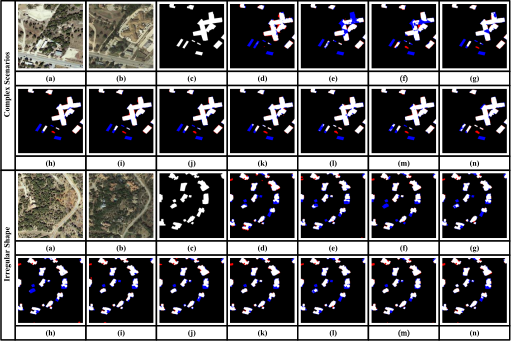

# IDA-SiamNet
This is a PyTorch implementation of the paper IDA-SiamNet: Interactive- and Dynamic-Aware Siamese Network for Building Change Detection


## simple usage
```
pip install -U openmim
mim install mmengine
mim install "mmcv>=2.0.0"
mim install "mmpretrain>=1.0.0rc7"
pip install "mmsegmentation>=1.0.0rc6"
pip install "mmdet>=3.0.0"
cd  IDA-SiamNet-main
pip install -v -e .
```

## Dataset preparation
```
      Data
      ├── LEVIR-CD
      │   ├── train
      │   │   ├── A
      │   │   ├── B
      │   │   ├── label
      │   ├── val
      │   │   ├── A
      │   │   ├── B
      │   │   ├── label
      │   ├── test
      │   │   ├── A
      │   │   ├── B
      │   │   ├── label
      │   ├── list
      │   │   ├── train.txt
      │   │   ├── val.txt
      │   │   ├── test.txt
```
## Train
```
python tools/train.py configs/idasiamnet/idasiamnet_ex_r18_512x512_40k_levircd.py --work-dir ./idasiam_r18_levir

python tools/train.py configs/idasiamnet/idasiamnet_ex_mit-b1_512x512_40k_levircd.py --work-dir ./idasiam_mit_levir

python tools/train.py configs/idasiamnet/idasiamnet_ex_r18_512x512_80k_s2looking.py --work-dir ./idasiamnet_r18_s2looking

python tools/train.py configs/idasiamnet/idasiamnet_ex_mit-b1_512x512_80k_s2looking.py --work-dir ./idasiamnet_mit_s2looking

python tools/train.py configs/idasiamnet/idasiamnet_ex_r18_256x256_100e_whucd.py --work-dir ./idasiamnet_r18_whucd

python tools/train.py configs/idasiamnet/idasiamnet_ex_mit-b1_256x256_100e_whucd.py --work-dir ./idasiamnet_mit_whucd
```

## Infer
```
python tools/test.py configs/idasiamnet/idasiamnet_ex_r18_512x512_40k_levircd.py idasiam_r18_levir/best_mIoU_iter_40000.pth

python tools/test.py configs/idasiamnet/idasiamnet_ex_mit-b1_512x512_40k_levircd.py idasiam_mit_levir/best_mIoU_iter_36000.pth

python tools/test.py configs/idasiamnet/idasiamnet_ex_r18_512x512_80k_s2looking.py idasiamnet_r18_s2looking/best_mIoU_iter_80000.pth

python tools/test.py configs/idasiamnet/idasiamnet_ex_mit-b1_512x512_80k_s2looking.py idasiamnet_mit_s2looking/best_mIoU_iter_80000.pth

python tools/test.py configs/idasiamnet/idasiamnet_ex_r18_256x256_100e_whucd.py idasiamnet_r18_whucd/best_mIoU_epoch_100.pth

python tools/test.py configs/idasiamnet/idasiamnet_ex_mit-b1_256x256_100e_whucd.py idasiamnet_mit_whucd/best_mIoU_epoch_100.pth
```
## Results
Visual comparison of building change results on the LEVIR-CD dataset.


(a) T1 image, (b) T2 image, (c) Change label, (d) TINYCD, (e) SNUNet/16, (f) DSIFN, (g) ChangerAD (ResNet18), (h) Changer (ResNet18), (i) IDA-SiamNet (ResNet18), (j) BiT, (k) ChangeFormer, (l) ChangerAD (MiT-b1), (m) Changer (MiT-b1), and (n) IDA-SiamNet (MiT-b1). White represents a true positive, black is a true negative, red indicates a false positive, and blue stands as a false negative.
## Pretrained Models

For readers to easily evaluate the accuracy, we provide the trained weights of the IDA-SiamNet

[Baidu](https://pan.baidu.com/s/132MzdDZLxIdzf-cNgXjNfw) (pswd: 143e)

## Citation

If you find this project useful in your research, please consider cite:

```bibtex
@ARTICLE{10551864,
  author={Li, Yun-Cheng and Lei, Sen and Liu, Nanqing and Li, Heng-Chao and Du, Qian},
  journal={IEEE Transactions on Geoscience and Remote Sensing}, 
  title={IDA-SiamNet: Interactive- and Dynamic-Aware Siamese Network for Building Change Detection}, 
  year={2024},
  volume={62},
  number={},
  pages={1-13},
  keywords={Buildings;Feature extraction;Shape;Transformers;Remote sensing;Decoding;Architecture;Building change detection (BCD);feature alignment;feature interaction;remote sensing image;Siamese network},
  doi={10.1109/TGRS.2024.3410977}}
```
